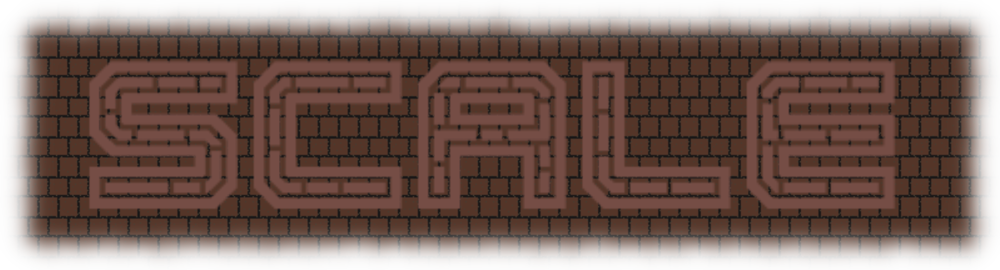

[//]: https://github.com/adam-p/markdown-here/wiki/Markdown-Cheatsheet

<a href="https://scale.dylanlangston.com/" title="Scale Game 🧗‍♂️">
  

    </img>
  

</a>

This [Progressive Web App](https://developer.mozilla.org/en-US/docs/Web/Progressive_web_apps) is a submission to the 2023 *Game Off* event hosted by [GitHub](https://github.com/) on [itch.io](https://itch.io/), It was created by [@dylanlangston](https://github.com/dylanlangston) using the following:
- [Zig](https://ziglang.org/)
- [Raylib](https://www.raylib.com/) via [Raylib-Zig](https://github.com/Not-Nik/raylib-zig/tree/devel)
- [Raygui](https://github.com/raysan5/raygui) via [Raygui.zig](https://github.com/ryupold/raygui.zig)
- [Emscripten](https://emscripten.org/)
- [Binaryen](https://github.com/WebAssembly/binaryen)
- [Svelte](https://svelte.dev/)
- [Typescript](https://www.typescriptlang.org/)
- [TailwindCSS](https://tailwindcss.com/)

This was my first attempt[^1] coding using Zig as well as my first app to target [web assembly](https://developer.mozilla.org/en-US/docs/WebAssembly). 

#### What's Game Off? [^2]

> [Game Off](https://itch.io/jam/game-off-2023) is GitHub's annual game jam challenging individuals and teams to build a game during the month of November. Use whatever programming languages, game engines, or libraries you like. You're also welcome to use AI tools to help generate code, assets, or anything in between!
>
> The theme for this year's jam is **SCALE**!

My interpretion of the theme is a vertical platformer that is procedurally generated. 

------

### Getting Started
*This repository includes a [devcontainer.json](https://github.com/dylanlangston/Scale/blob/main/.devcontainer/devcontainer.json) and prebuilt [Codespace](https://docs.github.com/en/codespaces/getting-started/quickstart) images to get up and running quickly with a full-featured development environment in the cloud!*[^3]

#### Clone
1. Clone this repository: `git clone https://github.com/dylanlangston/Scale.git`
2. Change directories into the newly created `./Scale` folder. Then initialize the submodules: `git submodule update --init --recursive`

#### Debug Locally:
1. If you haven't already, install Zig version 0.11.0 using the [instructions here](https://ziglang.org/learn/getting-started/#installing-zig).
2. Configure you build environment for Raylib using the appropriate [instructions](https://github.com/raysan5/raylib/wiki#development-platforms) for you platform.
3. Finally, to start the game run the command `zig build run`. Alternatively run the **_Debug_** task in VSCode.

#### Build for Web:
1. Complete steps to __Clone__ and __Debug Locally__ above first.
2. Change directories into the `./Scale` folder. Build the zig portion of the game using command `zig build -Dtarget=wasm32-emscripten`. Alternatively run the **_Build Web_** task in VSCode.
3. If you haven't already, install NodeJS LTS from [here](https://nodejs.org/en/download) (or your preferred source).
4. Change directories into the `./Scale/src/scale-website` folder. Then install the required node packages using `npm install`.
5. Build the web version by running the command `npm run build`. You can find the generated static site in the `./Scale/src/scale-website/build` folder.

------

### Credits
| Font | Source | License |
|:---- |:------:| -------:|
| _Eight Bit Dragon_ | https://www.fontspace.com/eight-bit-dragon-font-f30428 | Freeware, Non-Commercial |
| _Two Lines_ | https://www.fontspace.com/2-lines-font-f14541 | Freeware, Non-Commercial |
| _Ec Bricks Regular_ | https://www.fontspace.com/ec-bricks-font-f30951 | Creative Commons (by-nc-nd) Attribution  Non-commercial No Derivatives |

| Palette | Source |
|:-------:|:------:|
| _Miyazaki 16_ | https://lospec.com/palette-list/miyazaki-16 |

| Sound | Creator | Tool |
|:-------:|:------:|:---:|
| _[jump](./src/Sounds/jump.wav)_ | [miajohnson99](https://github.com/miajohnson99) | [Chiptone](https://sfbgames.itch.io/chiptone) |

[^1]: As this is my first attempt, it's likely that this code isn't idiomatic or following best practices.
[^2]: Game Off 2023 on [Itch.io](https://itch.io/jam/game-off-2023)
[^3]: For local development check out [Dev Containers](https://marketplace.visualstudio.com/items?itemName=ms-vscode-remote.remote-containers) and [DevPod](https://devpod.sh/).